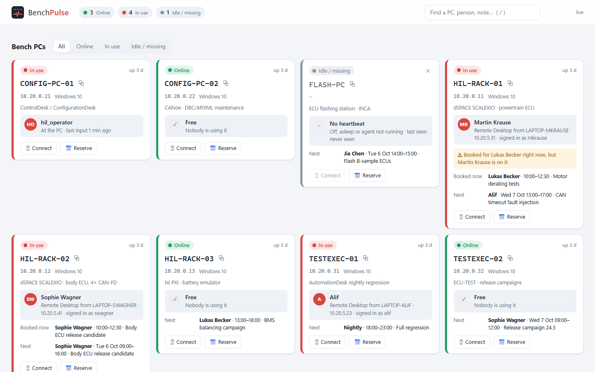
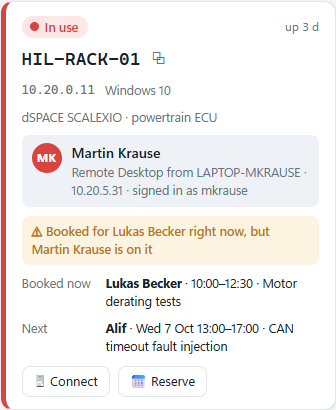
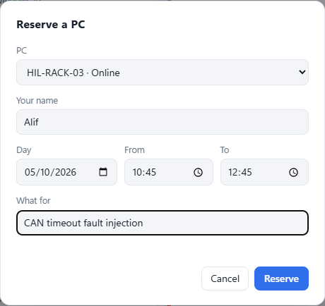
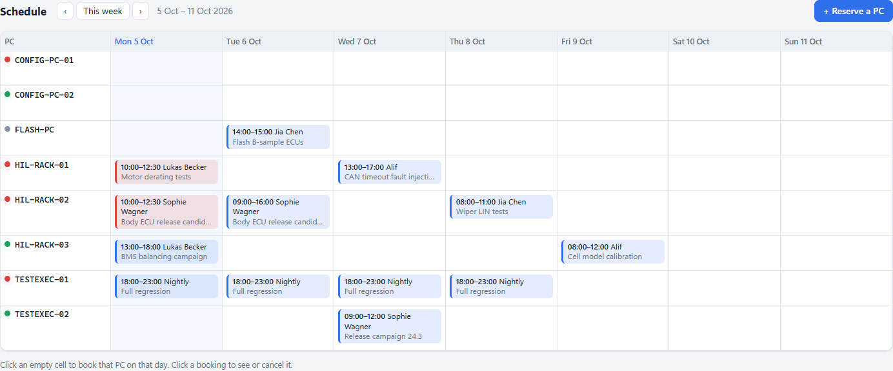
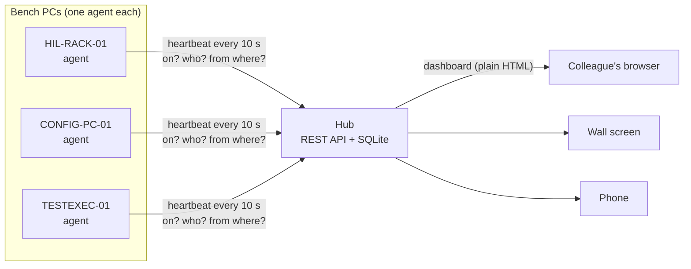

<p align="center">
  <picture>
    <source media="(prefers-color-scheme: dark)" srcset="assets/logo-dark.png">
    
  </picture>
</p>

<p align="center">
  <b>Which bench PC is free, who is on the busy ones, and when can I have it?</b><br>
  One browser page for a whole HiL lab. Colleagues install nothing; they just open the hub's address.
</p>

<p align="center">
  <a href="https://github.com/Alifizz01/BenchPulse/actions/workflows/ci.yml"></a>
  
  
  
  
</p>

<p align="center"></p>

---

## The problem

A hardware-in-the-loop lab doesn't run on one PC. There are rack PCs driving the real-time simulators, configuration PCs for the tool chains, test-execution PCs running campaigns overnight, a flashing station... and a team sharing all of them over **Remote Desktop**.

Every day the same questions cost time:

- **"Is HIL-RACK-02 free?"** You connect, and only then find out someone is mid-test. Remote Desktop kicks them out without a warning.
- **"Who is on it?"** All you see is a Windows user name like `hil_operator`, or nothing at all.
- **"Is it even on?"** After a power cut or a Windows update, half the bench may not have come back.
- **"What was its name again?"** You need the exact computer name to connect.
- **"Can I have it tomorrow morning?"** Bookings live in a chat, a whiteboard or an Excel file nobody updates.

I built the original version of this during my internship on a HiL test team, where all of the above happened weekly. **BenchPulse** is a clean-room re-implementation of that idea, written from scratch for this portfolio.

## What it does

| | |
|---|---|
| 🟢 **Online** | The PC is on and nobody is using it: go ahead. |
| 🔴 **In use** | Someone is connected over Remote Desktop, or working at the keyboard. |
| ⚪ **Idle / missing** | No heartbeat: switched off, crashed, asleep, or its agent isn't running. |

- **Live status of every bench PC**, updated every few seconds
- **Who's on it**: Remote Desktop reports the IP address and computer name the connection comes from. Map those to a name once in *Who's who* and the board shows **"Martin Krause, Remote Desktop from LAPTOP-MKRAUSE"** instead of a user name.
- **The PC name, ready to use**: copy it with one click, or press **Connect** to download a `.rdp` file that opens Remote Desktop straight to it
- **Reservations** with a clash check: nobody can double-book a PC, and back-to-back bookings are fine
- **Week schedule**: every PC against every day. Click an empty cell to book it.
- **Booking-clash warning**: if someone is on a PC that is booked for somebody else *right now*, the card says so
- **Notes per PC** ("dSPACE SCALEXIO · powertrain ECU", "ask Jia before flashing")
- **Search and filters**: by PC, person, IP or note; show only free PCs
- Light and dark mode, and it works on a phone

<table>
<tr>
<td width="50%"></td>
<td width="50%"></td>
</tr>
</table>

<p align="center"></p>

## How it works



**The agent** (on each bench PC) asks Windows who is signed in, through the Terminal Services API (`wtsapi32`, called with `ctypes`, so it needs no install and no `qwinsta` parsing):

- an **active `RDP-Tcp#…` session** means *in use*, together with the user name and the **client's computer name and IP** that Windows records for every Remote Desktop connection;
- otherwise, an **active console session with keyboard or mouse input in the last 15 minutes** means *in use* locally;
- otherwise the PC is *online* and free.

It sends that to the hub every 10 s. If the hub is down, it just keeps trying.

**The hub** stores the last heartbeat of every PC, the bookings and the who's-who list in one SQLite file. A PC that hasn't reported for 30 s is shown as *missing*. The dashboard is one static page polling `/api/board`, so any browser on the network works, with no install, plug-in or login.

> Why heartbeats and not ping? Ping only answers "is the network card up". A heartbeat also says *who is using it*, and a PC whose agent stops (crash, freeze) correctly drops to *missing* even if it still answers ping.

## Try it (30 seconds, no lab needed)

```bash
git clone https://github.com/Alifizz01/BenchPulse
cd BenchPulse
python -m benchpulse demo          # opens http://127.0.0.1:8600 with a simulated bench of 8 PCs
```

People come and go on the simulated PCs every few seconds; book, cancel and search as you like.

## Set it up in a lab

Python 3.9+ on the hub and on each bench PC. There are **no other dependencies**.

**1. The hub**, on any always-on PC:

```bash
pip install git+https://github.com/Alifizz01/BenchPulse
benchpulse hub                       # -> BenchPulse hub on http://10.20.0.5:8600
benchpulse hub --install             # Windows: start it at every logon
```

Tell colleagues the address. That's their whole setup.

**2. An agent on every bench PC:**

```bash
pip install git+https://github.com/Alifizz01/BenchPulse
benchpulse agent --hub http://10.20.0.5:8600 --once      # check: prints what it detects, sends one heartbeat
benchpulse agent --hub http://10.20.0.5:8600 --install   # start it at every logon, no console window
```

The agent should run in the bench PC's signed-in session (that's what `--install` does), because keyboard idle time is per session.

**Optional:** `--token SECRET` on the hub and on every agent (or `BENCHPULSE_TOKEN=SECRET`) so only your agents can report.

| Hub option | Default | |
|---|---|---|
| `--port` | 8600 | |
| `--db` | `~/.benchpulse.db` | one SQLite file; back it up, or delete it to start over |
| `--timeout` | 30 s | silence after which a PC counts as *missing* |
| `--token` | none | shared secret for agents |

`benchpulse status --hub http://10.20.0.5:8600` prints the board in a terminal.

## API

Everything the page does is plain HTTP + JSON, so scripts can use it too: a CI job can book a rack before a nightly run, or a test script can check a PC is free first.

```
GET    /api/board                      all PCs: status, who, booked now / next
GET    /api/reservations?from=&to=     bookings overlapping a window (YYYY-MM-DDTHH:MM)
POST   /api/reservations               {pc, who, start, end, purpose}   -> 201, or 409 with who has it
DELETE /api/reservations/<id>
GET    /api/people                     who's who
POST   /api/people                     {key: "10.20.5.23" or "LAPTOP-MAX", person: "Max"}
POST   /api/pcs/<name>/note            {note}
DELETE /api/pcs/<name>                 remove a retired PC
POST   /api/heartbeat                  (agents)
GET    /rdp/<name>.rdp                 Remote Desktop file
```

```bash
# is the rack free, and book it for the nightly run if so
curl -s http://10.20.0.5:8600/api/board | jq '.pcs[] | select(.name=="HIL-RACK-01") | .status'
curl -s -X POST http://10.20.0.5:8600/api/reservations -H 'Content-Type: application/json' \
     -d '{"pc":"HIL-RACK-01","who":"Nightly","start":"2026-10-06T20:00","end":"2026-10-07T06:00","purpose":"regression"}'
```

## Design notes

- **Standard library only.** Lab PCs are often locked down and offline; `pip install` of a web framework is not a given there. The hub is `http.server` + `sqlite3`, the agent is `ctypes` + `urllib`.
- **Nothing to install for colleagues.** The UI is one HTML file with vanilla JS. It works in any browser, including the locked-down one on a test PC.
- **Trusted-LAN tool, not internet-facing.** There are no user accounts: anyone who can open the page can book and cancel, as with a shared whiteboard. Write requests must be JSON, so a random web page a colleague visits can't post bookings through their browser (no CORS preflight). The agent token keeps fake heartbeats out. Put the hub behind your VPN, never on the internet.
- **Times are lab wall-clock time** (what you type is what everyone sees), which suits a team in one place.

## Tests

```bash
python -m unittest discover -s tests -t . -v
```

The 19 tests cover session classification, the WTS address parsing, booking clashes, status and timeouts, who's-who lookups and clash flags, and the real HTTP server (tokens, 409s, form-post refusal, `.rdp` downloads, path traversal). CI runs them on Linux and Windows with Python 3.9 and 3.13, and runs the real session probe on a Windows runner.

## License

MIT © Muhamad Alif Izzuwan Bin Ibrahim
